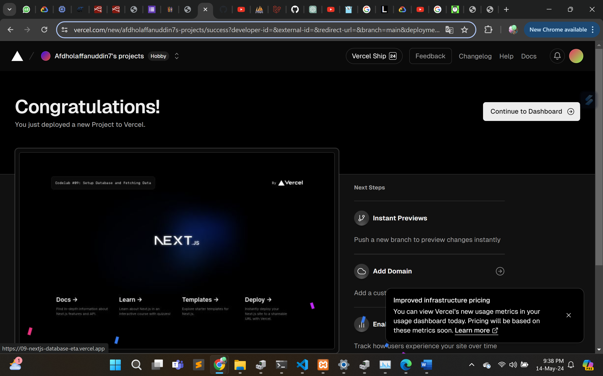
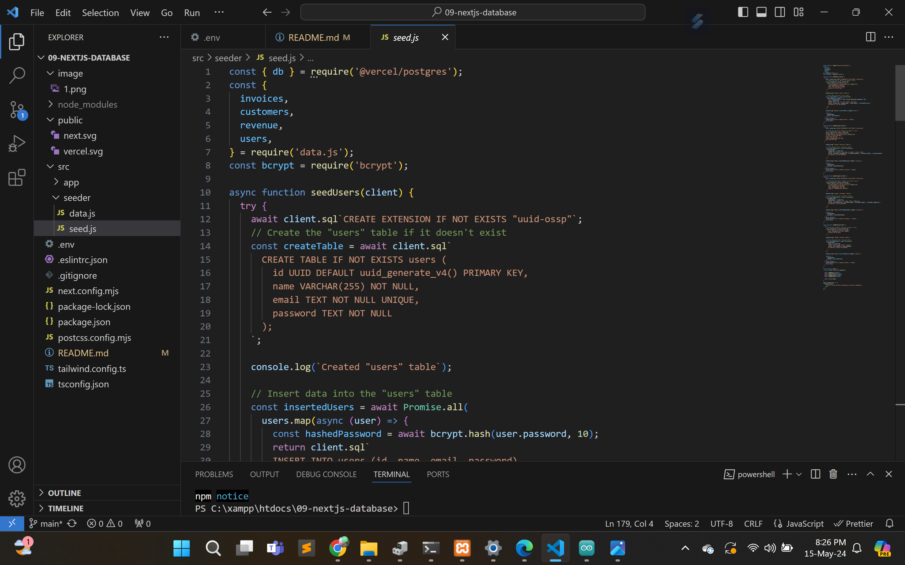
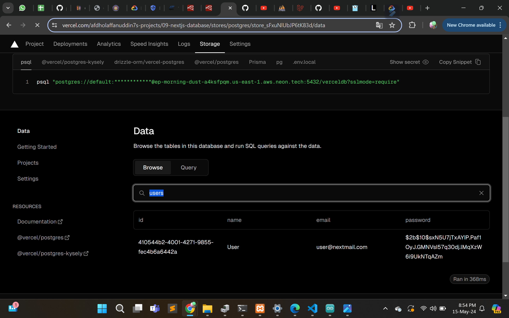
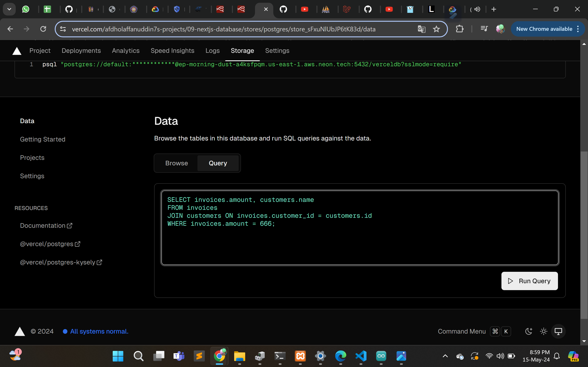
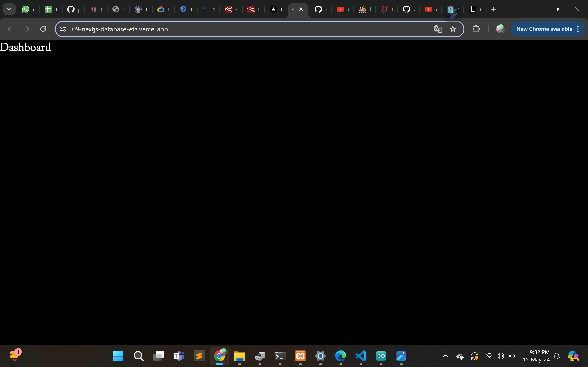
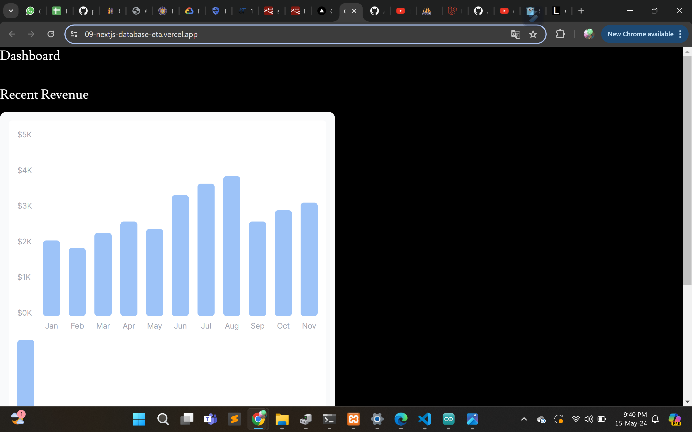
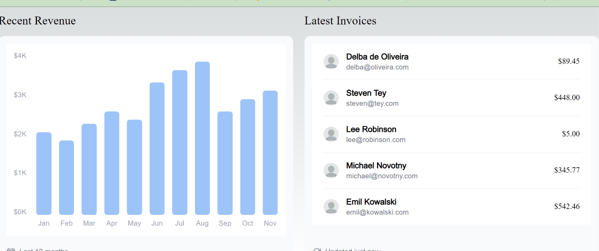

Praktikum Jobsheet 9

Praktikum 1

Soal 1

cara mendeploy project next js

Soal 2

Vercel juga berfungsi untuk mengcreate sebuah database

Soal 3

Db diisi dengan sebuah data dan table di cretae masing2

Soal 4

Menggabungkan tabel Customers dan Invoice

Soal 5

Hasil dari deploy project

https://09-nextjs-database-eta.vercel.app/

Soal 6

Akan menampilkan sebuah grafik

Soal 7

Menampilkan dari hasil adata short

